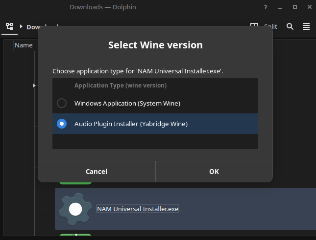

# Yabridge installer (for Ubuntu Studio)
This is a script build on Ubuntu Studio 24.04, but it could work on other debian based systems too. The attempt is to simplify the magical install procedure of Windows VSTs/CLAPs up to the point that after running this script, user never needs to use terminal to install more such plugins. It will also deal with the issue of specific wine version dependecy (staging 9.21) that is atleast in yabridge 5.1.1.

RUN AS USER, NOT AS SUDO!

Password will be prompted when needed.

```bash
git clone https://github.com/sirsipe/yabridge-setup
chmod +x yabridge-setup/ubuntu-yabridge-installer.sh
./yabridge-setup/ubuntu-yabridge-installer.sh
```

## What's the purpose of this?
Since yabridge (5.1.1) requires very specific wine version to run (wine-staging-9.21), and it's not reasonable to hold "system wine" back just for that purpose, this script is designed to setup secondary wine version that is separated from the system wine, to ```/opt/wine-staging-9.21/```. This way system can always be kept up-to-date.

This script also installs yabridge to recommonded location ($HOME/.local/share/) and creates isolated windows environment "WINEPREFIX" to $HOME/.wine-yb, and performs ```winetricks dxvk``` on that. Winetricks is because recent JUCE based plugins utilize DirectX for drawing the GUI and that will not work without the dxvk patch. But note that your GPU driver must have Vulkan support, or you're going to have a bad time.

The script will also create a new command ```/usr/local/bin/yb-env``` that can be used as prefix to launch "anything" in the secondary wine's context. For example ```yb-env wine --version``` will output ```wine-9.21 (Staging)``` and ```yb-env winetricks dxvk``` is the command used to install DirectX support to ```$HOME/.wine-yb```, as WINEPREFIX is defaulted to that unless specifically given. But ```wine --version``` will output whatever your system wine's version is.

Yabridge has ```yabridge-host.exe``` and ```yabridge-host-32.exe``` programs. This script replaces them with a script that invoke their ```...exe.raw``` -copies with ```yb-env``` context. Benefit of this is that yabridge will then always run the plugins using wine-staging-9.21 and ```$HOME/.wine-yb``` WINERPEFIX, and user doesn't have to play with environment variables.

The script pre-defines bunch of common VST and CLAP folders from ```$HOME/.wine-yb``` for yabridge. The folders are:
- C:/Program Files/Common Files/VST3"
- C:/Program Files/Common Files/CLAP"
- C:/Program Files (x86)/Common Files/CLAP"
- C:/Program Files/VST Plugins"
- C:/Program Files/Steinberg/VSTPlugins"
- C:/Program Files/Common Files/VST2"
- C:/Program Files/Common Files/Steinberg/VST2"

Last but not least, this script creates ```/usr/local/bin/wine-version-selector``` command that prompts user whether the  application should be executed with "System Wine" or "Yabridge Wine". Latter will obviously install the plugin to the ```$HOME/.wine-yb``` using wine-staging-9.21, but it will also automatically invoke ```yabridgectl sync``` after executable has been ran. ```/usr/local/bin/wine-version-selector``` is set as default application for Windows .exe and .msi files.


## Is it Perfect?
No. The secondary wine installation is NOT fully contanerized, but depends on multiple libraries that are easiest to obtain by simply installing latest version of wine to the system. This is why this script will also install wine to the system, and it has to install also i386 libraries for it. **This is somewhat fragile setup** as it assumes the version we pull on side has the same dependencies.

## TODO:
- Should add known required yabridge groupings and configurations, (or maybe force all to same process, what's the downside?)
- Testing testing testing...
